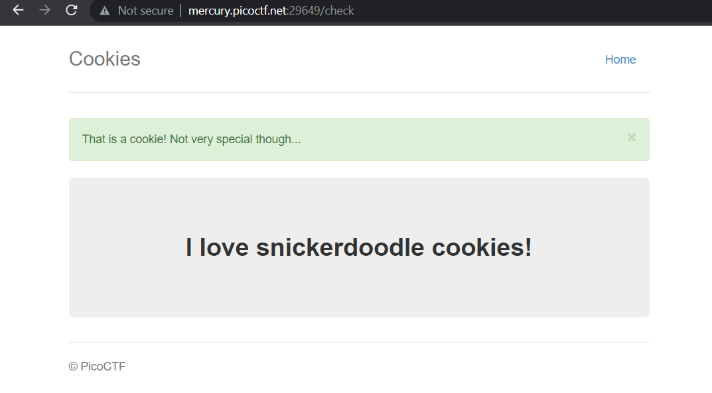

# Cookies

**Description:** Who doesn't love cookies? Try to figure out the best one.

**Points:** 40

**Solution**

The challange makes me go to the Cookie DevTool in the browser, when using Google Chrome we can see it by pressing `Ctrl+Shift+I` and opne the `Application` tab. Choose the `Cookie` menu in the `Storage` section.

Enter `snickerdoodle` to the input page of the web and we will

Try changing the value of `name` in the cookie (make sure select first on of the cookie), from 1, 2, 3, and so on and realoding after each value change make the text displayed is changed. And until `18`, the flag is displayed.

**Flag:** picoCTF{3v3ry1_l0v3s_c00k135_a1f5bdb7}

**Reference:** https://docs.abbasmj.com/ctf-writeups/picoctf2021
